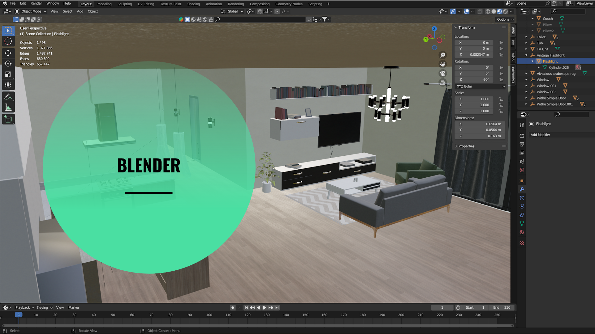
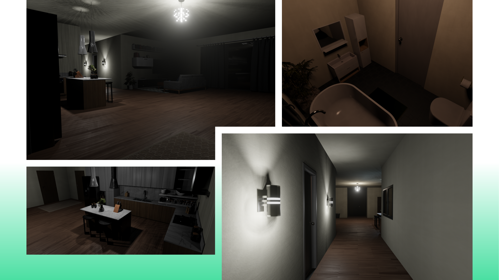
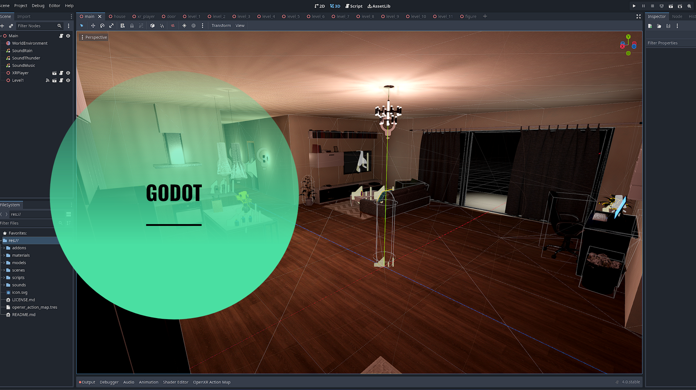
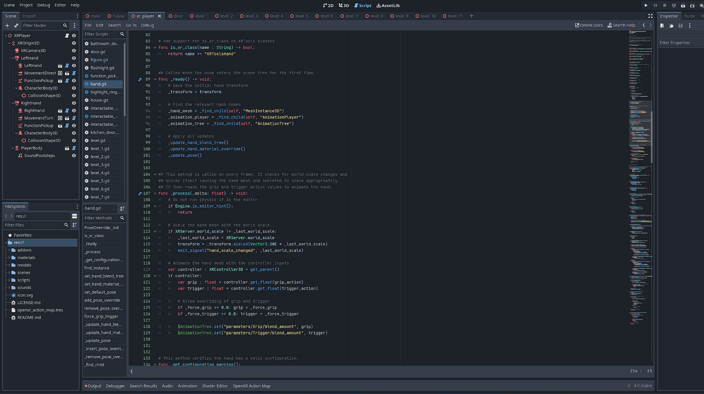
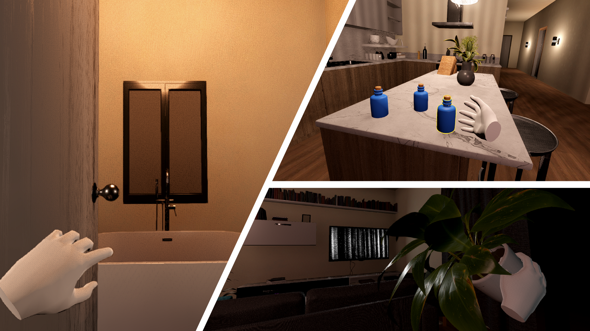

# vr-class-horror-game

- [vr-class-horror-game](#vr-class-horror-game)
  - [Blender](#blender)
  - [Godot](#godot)
  - [Running The Project](#running-the-project)
    - [Known Issues](#known-issues)

Developed for a VR class at PSU. Made using Godot and Blender.  
I enjoy using FOSS tools and wanted to see what I could come with.  
The themes of the game are inspired from the demo [PT](https://en.wikipedia.org/wiki/P.T._(video_game)) and a film called [Skinamarink](https://www.imdb.com/title/tt21307994/)  
Ulimately though, this is a short demo that aims to tackle many VR aspects, like interations with objects, physics, movement, sounds, and more.

## Blender

Utilized [Blender](https://www.blender.org/) and [Blender Kit](https://www.blenderkit.com/) to create the environment for the short demo.

## Godot

The [Godot](https://godotengine.org/) Engine is a FOSS, all-in-one, cross-platform game engine.  
This was the backbone of the project, and what allowed all these assets and ideas to come together.  
It is easy to use and feature rich.

I used a library to help me develop the XR capabilities. This being [Godot XR Tools](https://github.com/GodotVR/godot-xr-tools)

## Running The Project

Running the project is pretty straightforward but does require a VR setup.  
Personally, I used a Quest 2 through Oculus Link or Steam VR.  

Simply clone the repo:  
`git clone https://github.com/smithcol11/vr-class-horror-game.git`

The project was developed using the first stable release of Godot 4.0, so, I recommend using that.  
[Godot 4.0 Stable Download](https://godotengine.org/download/archive/4.0-stable/)

Then open the project using Godot and run! :)

### Known Issues

There are a few known problems with the demo at the moment. Here is a list of the ones I can recall.  
1. At least on Quest 2; black pixelated banding in the hallway when looking at it from certain angles.  
2. When exporting, the video texture for the TV seems to bug out and be absent. I spent a little bit of time trying to solve this, but didn't give it the attention it needs. It remains an issue.  
3. Not sure if this is an issue with my implementation or from godot-xr-tools, but you can pick up objects when you aren't actually near them if you angle your hands in just the right way. This is likely an oversight from me, but again I didn't spend time tracking this down. 